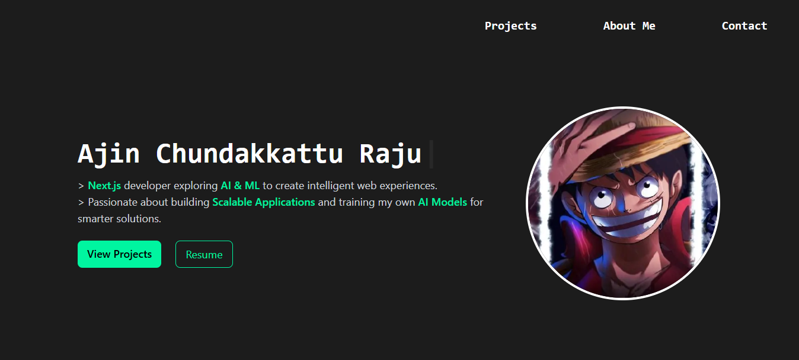

You can visit the website on https://ajinscrew.vercel.app/

A modern personal portfolio website showcasing projects, skills, and contact information. Built with Next.js, Tailwind CSS, Framer Motion, and React components, this portfolio is fully responsive and optimized for both desktop and mobile devices.

📂 Technologies Used
Next.js (App Router) – for server-side rendering and routing.
React – component-based architecture.
Tailwind CSS – responsive and modern UI styling.
Framer Motion – smooth animations for sections.
React Simple Typewriter – typewriter text effect in hero section.
Lucide React Icons – clean icons for social links.
Next/Image – optimized image loading.
